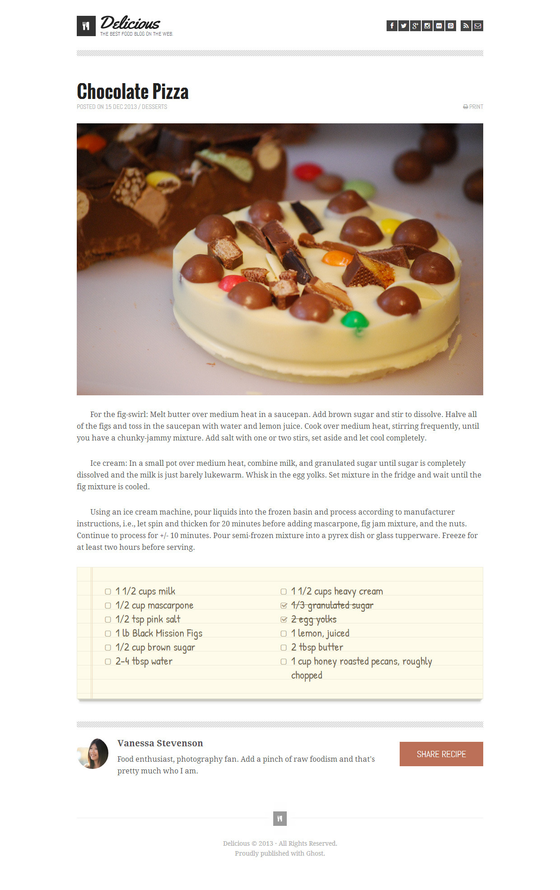

# chocolate-pizza

## Problem Domain

Your boss comes up to you just before lunch: “OK, we just picked up this job, but I need it on my desk (well, in my inbox) in four hours. It doesn’t need to be perfect… it needs to be as close to perfect as you can get it in that time.”

In lab today you will be building a single webpage based off of the provided design comp assets. This assignment is a lot of HTML and CSS, and not as much JS as we’ve been doing this week. In fact, you may choose to do this project with no JS at all, or just add some as a finishing touch.

When available, your instructor will pair you with a partner for this lab. You are free to set up whatever workflow you choose with your partner.

You only have 4 hours to complete this assignment.

## Instructions

- [x] Create a new repository for today called chocolate-pizza. If partnered for this lab, follow the pair programming work flow by having one user fork the other so that you can get some practice in your Git processes. Be sure to do frequent commits, and always do your work on branches. Before starting coding, think about a strategy for approaching this project. Before writing code, think about a practical order in which to do the work:

* When should you focus on styling?
    at the end of the webpage dev phase
* When should you make a decision about a layout scheme?
    at the very beginning of making website
* When should you just build out the structure of the HTML?
    after decide the layout scheme. then starting to build structure of the website
* When you should you add JS? Do you even add JS?
after the barebone structure and layout complete. we will write it later.
* If partnered, make sure to “swap” driver and navigator 2 hours into the challenge.

- [x] Suggestion: Set up your work directory like this:

index.html
style.css
app.js (if you choose to use JS)
img/ (a directory that contains all of your image assets)
If you want to rename any of the image files, feel free to do so. The same goes for pretty much anything else you come up with as a way to do the work.

.

